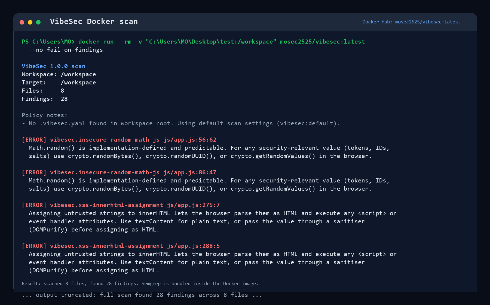

# SecureCycle Docker Scanner

The Docker image bundles SecureCycle's CLI scanner with Semgrep, so users can scan a project without installing Semgrep on the host. Users only need Docker.

## Install And Run From GHCR

From any project directory:

```bash
docker run --rm -v "$PWD:/workspace" ghcr.io/mosec2525/securecycle:latest
```

PowerShell:

```powershell
docker run --rm -v "${PWD}:/workspace" ghcr.io/mosec2525/securecycle:latest
```

Docker pulls the image automatically the first time. After that, the image is cached locally and runs faster.



## Build Locally

```bash
docker build -t securecycle:local .
```

## Scan A Project

From a project directory:

```bash
docker run --rm -v "$PWD:/workspace" securecycle:local
```

PowerShell:

```powershell
docker run --rm -v "${PWD}:/workspace" securecycle:local
```

The container scans `/workspace` by default. It uses the mounted project's `.vibesec.yaml` when present, otherwise it falls back to the bundled `vibesec:default` policy.

## JSON Output

```bash
docker run --rm -v "$PWD:/workspace" securecycle:local --json
```

## Exit Codes

- `0`: scan completed with no findings
- `1`: scan completed and found issues
- `2`: scan failed

Use `--no-fail-on-findings` when you want findings reported but a zero exit code:

```bash
docker run --rm -v "$PWD:/workspace" securecycle:local --no-fail-on-findings
```

## Published Image

The current public image is published to GitHub Container Registry:

<https://github.com/Mosec2525/securecycle/pkgs/container/securecycle>

```bash
docker pull ghcr.io/mosec2525/securecycle:latest
docker run --rm -v "$PWD:/workspace" ghcr.io/mosec2525/securecycle:latest
```

The legacy Docker Hub image remains available at <https://hub.docker.com/r/mosec2525/vibesec> for older instructions.
